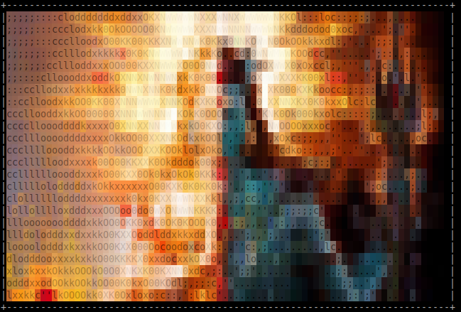

# Shiva JIT micropatching engine


## Description

Shiva is an ELF dynamic linker that is specialized for patching native Linux
software, supporting AArch64 and X86_64 architectures. Shiva was invented in
2021 and has continued to evolve throughout the DARPA AMP and DARPA EBOSS
programs.

Patches are written in C and compiled into ELF relocatable objects. Shiva is an
ELF interpreter that loads, links, and patches the new code into memory at
load-time.  Once the patch has been installed Shiva then maps
"/lib/ld-linux.so" into memory and transfers control to it in order to finish
loading before program startup. We call this "Chained linking" where more than
one dynamic linker can be chained together for program startup

### DARPA

Shiva has continued to evolve through the DARPA AMP and DARPA EBOSS (Contract No. HR001124C0488)
programs. Any opinions, findings and conclusions or recommendations expressed in this material
are those of the author and do not necessarily reflect the views of the Defense Advanced Research
Project Agency (DARPA).

## Support

OS: Linux
Architectures:
	- AArch64 : Tested with Ubuntu 18, 20
	- X86_64 : Tested with Ubuntu 20, 22, 24
ELF binary support: ELF PIE executables (aka. ET_DYN)

Support for ET_EXEC can be implemented relatively easily but
it has not been a high priority since modern Linux systems
do not often use them for security reasons.

## Build

The build process is separated into two distinct branches.

### x86_64 Shiva build

If you want to build the x86_64 Shiva you currently have
to checkout the branch: "x86_64_port" as it has not been
merged into the main branch yet.

### AArch64 Shiva build

Checkout the main branch to build AArch64 Shiva.

Shiva relies on libelfmaster, musl-libc, and libcapstone.
For now it has a pre-built version of libcapstone that is
statically linked with musl-libc.

(libcapstone.a for AArch64 and libcapstone_x86_64.a for x86_64).

For AArch64 Linux make sure to see the friendly user-guide :)
This will tell you everything you need to know in order to patch in Linux
AArch64.

https://github.com/advanced-microcode-patching/shiva_user_manual

## Dependencies


#### libelfmaster

```
git clone git@github.com:elfmaster/libelfmaster
cd libelfmaster/src

```

In X86_64 Shiva can only be built properly when libelfmaster
is compiled with musl-libc (As the Shiva binary is)
In AArch64 it's not necessary to build libelfmaster with
musl-libc, but it won't hurt.

```
make musl
sudo make musl-install
```

The static library to libelfmaster
```/opt/elfmaster/lib/libelfmaster.a```

The header file to libelfmaster
```/opt/elfmaster/include/elfmaster.h```


#### musl-libc

```
sudo apt-get install musl musl-dev musl-tools
```

## Building Shiva

### Clone the correct Shiva repo

```
cd ~/git
git clone git@github.com:advanced-microcode-patching/shiva
cd shiva
```

### Build for x86_64 Linux

(NOTE: The DWARF support has primarily been tested on ubuntu 22 and 24)

x86_64 Linux has DWARF support that requires libelf and a
musl-libc static library for libdwarf.

```
git checkout x86_64_port
sudo apt-get install libelf-dev
sudo ./build_dwarf.sh
make
sudo make install
```

### Build shiva AArch64

```
make
make shiva-ld
make patches
sudo make install
```

## Build artifacts

The Shiva micropatching system is made up of two programs: "shiva" and "shiva-ld"

### shiva: The custom ELF dynamic linker

Shiva, the dynamic linker, is placed in /lib/shiva with a symlink from /usr/bin/shiva
Shiva can be invoked directly as an executable or used as the primary ELF interpreter
in a program. 

Shiva is responsible for the patching at runtime. It's a program loader, linker, and
transformer that treats ELF relocatable objects ".o" files, as first class modules for
patching.

Shiva is copied to `/lib/shiva` and can be executed directly or indirectly as
an interpreter.

### shiva-ld: The Shiva ELF prelinker

The shiva-ld utility is known as the "Shiva Prelinker". It installs the basic
meta-data and linking meta-data into a binary that is necessary for the patch to be
properly installed at load-time. Primarily this tool modifies the PT_INTERP segment
changing it from "/lib/ld-linux.so" to "/lib/shiva" and adding an extra PT_LOAD segment
in order to make room for custom ELF sections and a new larger dynamic segment that
contains several new dtags describing the patch pathname among other things.

The shiva-ld tool is placed in `/usr/bin`


## How to build/compile/link the ELF executables that you will be patching

Generally speaking Shiva makes no assumptions about how you build your software. It tries
to be a robust and dynamic approach to many types of ELF binaries. Presently it does not
work on ET_EXEC type files (As they are few these days) but it has varying support for most
ELF PIE binaries that are of a supported architecture (x86_64 and aarch64)--

1. The ELF executable must have a PT_INTERP segment (i.e. be dynamically linked)

    Presently the ELF executable must have a PT_INTERP segment which any dynamically linked
    executable will already have.  In the future Shiva will work with fully
    statically linked executable too. I can accomplish this task in just a few days.

2. The ELF executable should ideally have a complete symbol table (But not entirely necessary).

    Shiva is a symbolically driven patching system. In other words it allows developers
    to re-write code and data by symbol name (i.e. function name, variable name, etc.). Therefore
    it is very helpful to atleast have a complete .symtab symbol table. Otherwise Shiva will still
    allow you to interpose any symbols that are witin the .dynsym (Dynamic symbol table).

NOTE ON STRIPPED BINARIES:
    Shiva is built with libelfmaster under the hood, it inherently has some symbol
    forensics capabilities, so it's able to reconstruct a basic symbol table for every
    function in the executable. In cases where the binary is stripped Shiva will allow you
    to interpose a function by it's "psuedo-symbol-name" in the format of: fn_0xdeadbeef
    (Changing deadbeef to the correct address).

    (NOTE: The symbol reconstruction feature is dependent on the PT_GNU_EH_FRAME segment
    existing.)

3. The ELF executable should ideally have the `.llvm_jump_table_sizes` section

    Shiva requires the `.llvm_jump-table_sizes` section to properly re-write
    jump-tables for functions that have splice patches being applied to them.  If a
    patch aims to function splice into a specific function, Shiva re-writes the
    entire function into a new location from scratch and it's corresponding
    jump-table can only be re-written correctly if the `.llvm_jump_table_sizes
    section exists.

    NOTE: Jump-table re-writing is only a feature in x86_64. Function splicing
    into functions that have jump-tables in AArch64 Linux will currently cause
    the new patched function to jump back into the old function. This is a big
    problem, and will be fixed upon request.

4. The binary must be PIE (position independent), i.e. gcc -pie -fPIC test.c -o test

## Patch example in AArch64 Linux

$ cd modules/aarch64/cfs_patch1

Take a look at the Makefile for each patch, and you will see how shiva-ld is
used to apply the pre-patch meta-data.

```
shiva-ld -e core-cpu1 -p cfs_patch1.o -i /lib/shiva -s /opt/shiva/modules -o core-cpu1.patched
```

The Shiva install script installs all of the patch modules into `/opt/shiva/modules`

The patch build environments are stored in `modules/aarch64_patches/` and are as follows:

### CFS Binary patch: cfs_patch1

This is just a simple patch that uses symbol interposition to replace the
STB_GLOBAL/STT_FUNC `OS_printf` that lives within the `core-cpu1` executable.
The patch `cfs_patch1.c` simply rewrites its own version of the function.

The contents of the `./modules/aarch64_patches/cfs_patch1`

```
elfmaster@esoteric-aarch64:~/amp/shiva/modules/aarch64_patches/cfs_patch1$ ls
cfs_patch1.c  cfs_patch1.o  core-cpu1  core-cpu1.patched  EEPROM.DAT  Makefile
```

The program that we are patching is `core-cpu1` and specifically the symbol `OS_printf`

```
elfmaster@esoteric-aarch64:~/amp/shiva/modules/aarch64_patches/cfs_patch1$ readelf -s core-cpu1 | grep OS_printf
   241: 0000000000047d88   456 FUNC    GLOBAL DEFAULT   13 OS_printf
```

Our patch contains it's own version of the function `OS_printf` and at runtime Shiva will load
the `/opt/shiva/modules/cfs_patch1.o` handle all of it's own relocations, and then it will externally
re-link `core-cpu1` so that any calls to the old `OS_printf` are patched to call the new `OS_printf`
that lives within the modules runtime environment setup by Shiva.


```
elfmaster@esoteric-aarch64:~/amp/shiva/modules/aarch64_patches/cfs_patch1$ cat cfs_patch1.c
#include <stdarg.h>
#include <stdlib.h>
#include <stdint.h>
#include <stdio.h>

void OS_printf(const char *string, ...)
{
	char msg_buffer[4096];
	va_list va;
	int sz;

	va_start(va, string);
	sz = vsnprintf(msg_buffer, sizeof(msg_buffer), string, va);
	va_end(va);
	msg_buffer[sz] = '\0';
	printf("[PATCHED :)]: %s\n", msg_buffer); /* NOTICE THIS LINE */
}

```

A quick look at the `PT_INTERP` segment will reveal that `core-cpu1.patched` has `"/lib/shiva"`
set as the program interpreter.

```
elfmaster@esoteric-aarch64:~/amp/shiva/modules/aarch64_patches/cfs_patch1$ readelf -l core-cpu1.patched | grep interpreter
      [Requesting program interpreter: /lib/shiva]
```

Two custom dynamic segment entries were also added to the binary:

`SHIVA_DT_SEARCH` denotes a dynamic entry containing the address of the module search path,
usually set to `"/opt/shiva/modules/"`.

`SHIVA_DT_NEEDED` denotes a dynamic entry containing the address of the module basename,
i.e. `"cfs_patch1.o"`.

```
elfmaster@esoteric-aarch64:~/amp/shiva/modules/aarch64_patches/cfs_patch1$ readelf -d core-cpu1.patched  | tail -n 3
 0x0000000060000018 (Operating System specific: 60000018)                0x1ab200
 0x0000000060000017 (Operating System specific: 60000017)                0x1ab213
 0x0000000000000000 (NULL)               0x0
```

NOTE: The new dynamic segment lives within a newly created PT_LOAD segment. The new PT_LOAD segment
is the result of a PT_NOTE to PT_LOAD transition.

#### Running core-cpu1.patched


When running the `./core-cpu.patched` we see in the last stdout line our patched
`OS_printf` executes. Notice it prefaces each line of output with the string `"[PATCHED :)]"`

```
elfmaster@esoteric-aarch64:~/amp/shiva/modules/aarch64_patches/cfs_patch1$ ./core-cpu1.patched 
OS_BSP_Initialize():Maximum user msg queue depth = 10
CFE_PSP: Default Reset SubType = 1
CFE_PSP: Default CPU ID = 1
CFE_PSP: Default Spacecraft ID = 66
CFE_PSP: Default CPU Name: cpu1
OS_Posix_GetSchedulerParams():186:Policy 1: available, min-max: 1-99
OS_Posix_GetSchedulerParams():186:Policy 2: available, min-max: 1-99
OS_Posix_TaskAPI_Impl_Init():372:Selected policy 2 for RT tasks, root task = 99
OS_Posix_TaskAPI_Impl_Init():388:Could not setschedparam in main thread: Operation not permitted (1)
CFE_PSP: initializing module 'soft_timebase' with ID 0110ff00
CFE_PSP: Instantiated software timebase 'cFS-Master' running at 10000 usec
CFE_PSP: initializing module 'timebase_posix_clock' with ID 0110ff01
CFE_PSP: Using POSIX monotonic clock as CFE timebase
CFE_PSP: initializing module 'eeprom_mmap_file' with ID 0110ff02
CFE_PSP: Using MMAP simulated EEPROM implementation
[PATCHED :)]: CFE_PSP: EEPROM Range (2) created: Start Address = FFFF84032000, Size = 00080000 Status = 0
```

#### Patching .rodata symbols with Shiva: rodata_interposing patch.

`modules/aarch64_patches/rodata_interposing`

This patch demonstrates how Shiva is able to link new read-only data into place over
existing read-only data symbols. For example


The contents of the `rodata_interposing` directory

```
elfmaster@esoteric-aarch64:~/amp/shiva/modules/aarch64_patches/rodata_interposing$ ls
Makefile  ro_patch.c  ro_patch.o  test_rodata  test_rodata.c  test_rodata.patched
```

The original program has a read-only string `const char rodata_string[] = "Arcana Technologies"`

```
elfmaster@esoteric-aarch64:~/amp/shiva/modules/aarch64_patches/rodata_interposing$ readelf -s test_rodata | grep rodata_string
    73: 0000000000000800    20 OBJECT  GLOBAL DEFAULT   15 rodata_string
```

This constant string data is stored within the `.rodata section`.

```
objdump -D test_rodata | less

...

0000000000000800 <rodata_string>:
 800:   61637241        .word   0x61637241
 804:   5420616e        .word   0x5420616e
 808:   6e686365        .word   0x6e686365
 80c:   676f6c6f        .word   0x676f6c6f
 810:   00736569        .word   0x00736569
```

Our patch aims to change the string from `"Arcana Technologies"` to `"The Great Arcanum"`.

```
elfmaster@esoteric-aarch64:~/amp/shiva/modules/aarch64_patches/rodata_interposing$ cat ro_patch.c

const char rodata_string[] = "The Great Arcanum";

```

The compiled patch is `ro_patch.o`

At runtime Shiva will load and link the patch with the executable in memory, and all references
to the old `rodata_string[]` will be replaced with the correct offset to the patches version of
`rodata_string[]`. The original string is not being over-written, but is no longer referenced.


#### Running the unpatched and patched test_rodata binary

```
elfmaster@esoteric-aarch64:~/amp/shiva/modules/aarch64_patches/rodata_interposing$ ./test_rodata
rodata_string: Arcana Technologies
val: 5
elfmaster@esoteric-aarch64:~/amp/shiva/modules/aarch64_patches/rodata_interposing$ ./test_rodata.patched
rodata_string: The Great Arcanum
val: 5
elfmaster@esoteric-aarch64:~/amp/shiva/modules/aarch64_patches/rodata_interposing$ 
```

### Friendly user guide to micropatching with Shiva AArch64

Read the user manual. https://github.com/advanced-microcode-patching/shiva_user_manual


## Patch example in X86_64 Linux

Patching in X86_64 is mostly the same as in with AArch64. The following is an example
of how to splice a single printf line into a program right before another specified
source line number.

### Function splicing

Function splicing allows a patch developer to splice an arbitrary amount of C code into
a target function at a given address range.

#### Function splice example 1: Fix strcpy vuln

```
cd modules/x86_64_patches/fsplice/overflow
cat vuln.c
```

#### Original source code of vuln.c

```
int parse_string(char *s)
{
	char buf[16];
	char *p;

	strcpy(buf, s);

	printf("buf: %s\n", buf);
}

int main(int argc, char **argv)
{
	parse_string(argv[1]);
}
```

Our goal is to replace the `strcpy()` with a call to `strncpy()`.  A quick look
with objdump will shows us where to find the function arguments to `strcpy()`:
`char *src` and `char *dst` so that we can pass them to our new call to
`strncpy()`.  args in `strcpy()` are found in `RDI` and `(RBP-16)`,
respectively.

#### Disassembly for function parse_string

```
0000000000001169 <parse_string>:
    1169:       f3 0f 1e fa             endbr64
    116d:       55                      push   %rbp
    116e:       48 89 e5                mov    %rsp,%rbp
    1171:       48 83 ec 20             sub    $0x20,%rsp
    1175:       48 89 7d e8             mov    %rdi,-0x18(%rbp) -- First instruction to patch
    1179:       48 8b 55 e8             mov    -0x18(%rbp),%rdx 
    117d:       48 8d 45 f0             lea    -0x10(%rbp),%rax 
    1181:       48 89 d6                mov    %rdx,%rsi
    1184:       48 89 c7                mov    %rax,%rdi 
    1187:       e8 d4 fe ff ff          call   1060 <strcpy@plt> -- Last instruction to patch
    118c:       48 8d 45 f0             lea    -0x10(%rbp),%rax
    1190:       48 89 c6                mov    %rax,%rsi
    1193:       48 8d 05 6a 0e 00 00    lea    0xe6a(%rip),%rax        # 2004 <_IO_stdin_used+0x4>
    119a:       48 89 c7                mov    %rax,%rdi
    119d:       b8 00 00 00 00          mov    $0x0,%eax
    11a2:       e8 c9 fe ff ff          call   1070 <printf@plt>
    11a7:       90                      nop
    11a8:       c9                      leave
    11a9:       c3                      ret
```

We want to re-write the code in function `foo()` at address 0x1175 ending at
address 0x1187.  Our patch code that we are splicing into function `foo()`
should overwrite the code beginning at address 0x1175 and ending at the
instruction just before 0x1187. Shiva will be pushing the code at 0x1187
forward to make room for our splice code that is too large to fit otherwise.

#### Splice patch src code

Here is our patch source code to replace the call to `strcpy()` with a call
to `strncpy()`.

```
#include <stdint.h>
#include <stdio.h>
#include "shiva_module.h"

#define BUFLEN 16

SHIVA_MODULE_FORCE_MUSL_RESOLUTION;

SHIVA_T_SPLICE_FUNCTION(parse_string, 0x1175, 0x118c)
{
	SHIVA_T_PAIR_RDI(src);
	SHIVA_T_LEA_BP(dst, -16);
	strncpy(dst, src, BUFLEN-1);
}
```

Notice the usage of the `SHIVA_MODULE_FORCE_MUSL_RESOLUTION` macro. Without this
being declared then Shiva wouldn't be able to link the call to `strncpy()`. The
reason is that Shiva does not support linking to symbols of type `STT_IFUNC` of
which there are several dozen of in glibc. When it comes to needing to invoke a
function whos symbol type is `STT_IFUNC` it is necessary to force Shiva to
resolve the symbol from musl-libc instead, which is already baked right into
its own binary (i.e.  musl-libc is in /lib/shiva).

#### A list of the `STT_IFUNC` symbols in glibc.

Byte-string functions

    strcpy — copy a string
    strncpy — copy fixed-length string
    stpcpy — copy string and return pointer to terminating null
    strcat — concatenate strings
    strncat — concatenate fixed-length strings
    strcmp — compare two strings
    strncmp — compare fixed-length strings
    strchr / index — locate character in string
    strrchr / rindex — locate last occurrence of character
    strstr — locate substring
    strlen — compute string length
    strnlen — compute bounded string length

Memory functions

    memchr — locate byte in memory block
    memrchr — locate last byte in memory block
    rawmemchr — locate byte without length limit

Wide-character (wchar_t) functions

    wcslen — wide-character string length
    wcsnlen — bounded wide-character string length
    wcscpy — copy wide-character string
    wcsncpy — copy fixed-length wide-character string
    wcscat — concatenate wide-character strings
    wcsncat — concatenate fixed-length wide-character strings
    wcscmp — compare wide-character strings
    wcsncmp — compare fixed-length wide-character strings
    wcschr — locate wide character
    wcsrchr — locate last wide character
    wcscspn — span excluding wide characters from set
    wcsspn — span including wide characters from set
    wcspbrk — locate wide character in set
    wmemchr — locate wide character in wide block
    wmemrchr — locate last wide character in wide block


The patch creates an int64_t variable caled `src` from input register RDI and
stores the value of RBP-16 in an int64_t variable called `dst`. It passes these
as the correct arguments to `strncpy`.

#### Test ./vuln

This will cause a segfault

./vuln AAAAAAAAAAAAAAAAAAAAAAAAAAAAAAAAAAAAAAA


#### Test patched ./vuln

1. Compile the patch.

Use a large code model, disable the stack protection code, omit frame pointers (Not necessary with splice code).
Make sure to copy your patch into the correct search path after compiling it.

gcc -mcmodel=large -fno-stack-protector -fomit-frame-pointer -I /opt/shiva/include/ -c patch.c
sudo cp patch.o /opt/shiva/modules/

2. Prelink the binary

shiva-ld -i /lib/shiva -s /opt/shiva/modules -p patch.o -e vuln -o vuln.fixed

3. Test ./vuln.fixed

./vuln.fixed AAAAAAAAAAAAAAAAAAAAAAAAAAAAAAAAAAAAAAAAAAAAAAA

## Interposing shared library functions

Shiva can re-write most any function or global data code on the fly within the
main ELF executable, by both symbol interposition and function splicing
transforms-- however Shiva cannot currently splice code into a shared library
function, but it can interpose a shared library function if it is already being
called by the executable in some other place. If the function is already called
elsewhere then a PLT entry will exist for the shared library function and
therefore Shiva can easily redirect/interpose that.

In the event that we need to interpose a function within a shared library (Such
as with LD_PRELOAD) then we can use the Shiva prelinker to inject a DT_NEEDED
tag into the dynamic segment of the ELF executable in such a way that the new
shared libraries symbols will be resolved with precedence over any other
library.  This effectively creates a permenant LD_PRELOAD effect. This
technique has been documented by myself and other researchers over the years,
originally showing up in 2002/2003 Phrack magazine Cerberus ELF interface by
Mayhem.

Simply write a patch with the new definition of a given symbol (Global variable
or global function) and compile the patch into a shared library instead of a
relocatable object file. Copy the shared object patch into /lib/x86_64-linux-gnu
(Or another valid search path) and use ldconfig to update the cache.


### Author contact

Ryan O'Neill
ryan@bitlackeys.org

